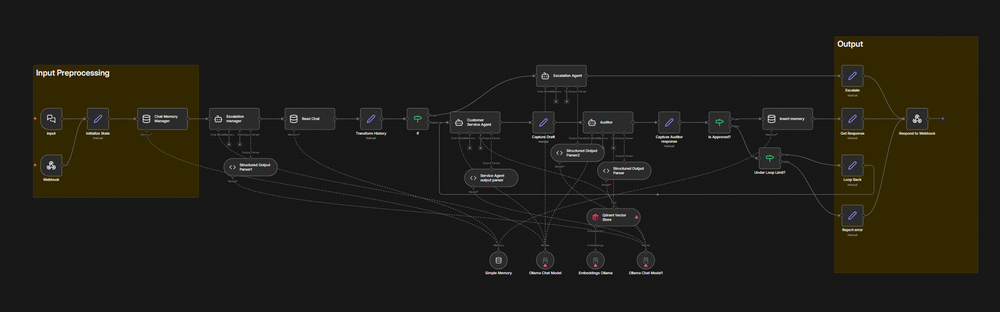

# NST Anti Frustration Agent



**Anti Frustration Agent** is an n8n workflow designed to improve user
experience with customer support interactions. It utilises RAG techniques and
audited pipelines  to ensure that users receive accurate, helpful and
personalized responses while guaranteeing that the LLMs does not hallucinate and
give responses that would damage the company's reputation or financially harm the company.

### What’s included

```bash
├── CONTRIBUTING.md
├── LICENSE
├── README.md
├── docker-compose.yml
├── n8n
│   └── demo-data
│       ├── credentials
│       └── workflows
├── scraper
│   ├── requirements.txt
│   └── scrape_dbs.py
└── shared
    ├── dbs-docs
    ├── gitlab-docs
    ├── policies
    └── policies-dbs
```

✅ [**Self-hosted n8n**](https://n8n.io/) - Low-code platform with over 400
integrations and advanced AI components

✅ [**Ollama**](https://ollama.com/) - Cross-platform LLM platform to install
and run the latest local LLMs

✅ [**Qdrant**](https://qdrant.tech/) - Open-source, high performance vector
store with an comprehensive API

✅ [**PostgreSQL**](https://www.postgresql.org/) -  Workhorse of the Data
Engineering world, handles large amounts of data safely.

✅ **Pre-built n8n workflows** - Ready-to-use workflows to try out our pipelines.

✅ **Docs to test out RAG**  - We’ve included a set of sample documents and
policies to test out the RAG capabilities of the workflow. We have also included
a sample scraper that scrapes DBS's website by default.

## Installation

### Cloning the Repository

```bash
git clone https://github.com/yihao03/nst-anti-frustration-agent
cd nst-anti-frustration-agent
cp .env.example .env # you should update secrets and passwords inside
```

### Running n8n using Docker Compose

#### For Nvidia GPU users

```bash
git clone https://github.com/yihao03/nst-anti-frustration-agent
cd nst-anti-frustration-agent
cp .env.example .env # you should update secrets and passwords inside
docker compose --profile gpu-nvidia up
```

> [!NOTE]
> If you have not used your Nvidia GPU with Docker before, please follow the
> [Ollama Docker instructions](https://github.com/ollama/ollama/blob/main/docs/docker.md).

### For AMD GPU users on Linux

```bash
git clone https://github.com/yihao03/nst-anti-frustration-agent
cd nst-anti-frustration-agent
cp .env.example .env # you should update secrets and passwords inside
docker compose --profile gpu-amd up
```

#### For Mac / Apple Silicon users

If you’re using a Mac with an M1 or newer processor, you can't expose your GPU
to the Docker instance, unfortunately. There are two options in this case:

1. Run the starter kit fully on CPU, like in the section "For everyone else"
   below
2. Run Ollama on your Mac for faster inference, and connect to that from the
   n8n instance

If you want to run Ollama on your mac, check the
[Ollama homepage](https://ollama.com/)
for installation instructions, and run the starter kit as follows:

```bash
git clone https://github.com/yihao03/nst-anti-frustration-agent
cd nst-anti-frustration-agent
cp .env.example .env # you should update secrets and passwords inside
docker compose up
```

##### For Mac users running OLLAMA locally

If you're running OLLAMA locally on your Mac (not in Docker), you need to modify the OLLAMA_HOST environment variable

1. Set OLLAMA_HOST to `host.docker.internal:11434` in your .env file.
2. Additionally, after you see "Editor is now accessible via: <http://localhost:5678/>":

    1. Head to <http://localhost:5678/home/credentials>
    2. Click on "Local Ollama service"
    3. Change the base URL to "<http://host.docker.internal:11434/>"

#### For everyone else

```bash
git clone https://github.com/yihao03/nst-anti-frustration-agent
cd nst-anti-frustration-agent
cp .env.example .env # you should update secrets and passwords inside
docker compose --profile cpu up
```

## ⚡️ Quick start and usage

The core of the Self-hosted AI Starter Kit is a Docker Compose file, pre-configured with network and storage settings, minimizing the need for additional installations.
After completing the installation steps above, simply follow the steps below to get started.

1. Open <http://localhost:5678/> in your browser to set up n8n. You’ll only
   have to do this once.
2. Open the ingestion workflow and execute it to create the vector database and
   generate embeddings for the sample documents. This workflow only needs to be
   run once. You can add your own documents and re-run the workflow to update the
   vector database with new embeddings.
3. Open the main workflow and execute it to test out the RAG pipeline. You can
   modify the prompt and test out different queries to see how the workflow
   responds.
4. If this is the first time you’re running the workflow, you may need to wait
   until Ollama finishes downloading qwen3-embedding:0.6b. You can inspect the docker
   console logs to check on the progress.

To open n8n at any time, visit <http://localhost:5678/> in your browser.

With your n8n instance, you’ll have access to over 400 integrations and a
suite of basic and advanced AI nodes such as
[AI Agent](https://docs.n8n.io/integrations/builtin/cluster-nodes/root-nodes/n8n-nodes-langchain.agent/),
[Text classifier](https://docs.n8n.io/integrations/builtin/cluster-nodes/root-nodes/n8n-nodes-langchain.text-classifier/),
and [Information Extractor](https://docs.n8n.io/integrations/builtin/cluster-nodes/root-nodes/n8n-nodes-langchain.information-extractor/)
nodes. To keep everything local, just remember to use the Ollama node for your
language model and Qdrant as your vector store.

## Upgrading

* ### For Nvidia GPU setups

```bash
docker compose --profile gpu-nvidia pull
docker compose create && docker compose --profile gpu-nvidia up
```

* ### For Mac / Apple Silicon users

```bash
docker compose pull
docker compose create && docker compose up
```

* ### For Non-GPU setups

```bash
docker compose --profile cpu pull
docker compose create && docker compose --profile cpu up
```

## 📜 License

This project is licensed under the Apache License 2.0 - see the
[LICENSE](LICENSE) file for details.
